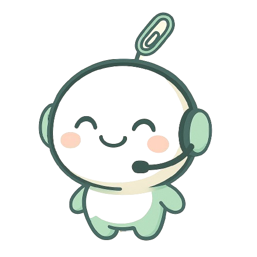

# 🐱‍💻 Tooktook (Personal Version)

> ✨ **본 프로젝트는 LG U+ WhyNot Camp 7기 팀 프로젝트에서 출발하였으며 개인 포트폴리오 용도로 구조와 내용을 재정비한 버전입니다.**

---

## 💬 프로젝트 개요

**Tooktook**은 상담사의 업무 효율성과 정확성을 높이기 위한 **AI 기반 실시간 상담 지원 시스템**입니다. 상담 중 발생하는 반복적이고 복잡한 문의 상황에서, 실시간 음성 인식(STT), 키워드 기반 응답 추천, 상담 요약 등 다양한 기능을 통해 상담사를 보조합니다.

  
  
   
  <em style="font-size: 13px; color: gray;">* GPT 기반 이미지 생성 툴을 활용해 제작된 캐릭터입니다.</em>

---

## 📓 프로젝트 문서 모음

툭툭 기획서 PDF

<a href="툭툭 기획서 PPT.pdf" target="_blank">툭툭 프로젝트 기획서 보러가기</a>

시스템 구조 및 기술 선택 배경

<a href="툭툭 시스템 구조 및 기술 선택 배경.pdf" target="_blank">세부 내용 (PDF)</a>

프로토타입

<a href="https://sjun4040.github.io/prototype/" target="_blank">▶️ 프로토타입 바로가기</a>

---

## Tooktook은 어떤 문제를 해결하나요?
상담사들이 고객 응대 중 가장 자주 겪는 고민은 다음과 같습니다:

> 비슷한 질문이 반복되는데, 답변을 찾는 데 시간이 오래 걸려요.   
> 상담이 몰리면 고객은 지치고, 저는 더 조급해져요.   
> 지금 이 고객에게 어떤 정보를 먼저 보여줘야 할지 모르겠어요.   

Tooktook(툭툭)은 이런 상담 현장의 반복적인 어려움을 AI 기술을 활용해 실시간으로 해결합니다.   
GPT가 대신 말해주는 것이 아니라   
상담사가 스스로 더 빠르고 정확하게 판단할 수 있도록 도와주는 보조 도구입니다.

---

## 시스템 개요

| 항목          | 내용                                           |
| ----------- | -------------------------------------------- |
| **프로젝트명**   | Tooktook (툭툭)                                |
| **프로젝트 목표** | 상담사의 업무 효율성과 정확도 향상                          |
| **해결 방식**   | STT(음성→텍스트) + 키워드 추출 + RAG 기반 문서 추천 + 실시간 요약 |
| **최종 사용자**  | 고객 상담사 (콜센터, 민원센터 등)                         |

---

## 주요 문제 해결 흐름
**Tooktook이 하는 일**   
고객의 음성을 텍스트로 변환 (STT)   
상담 대화에서 주요 키워드 자동 추출   
벡터 DB를 통해 관련 정책/매뉴얼 문서에서 적절한 문장 추천 (RAG 방식)   
상담 중 주요 내용을 실시간 요약하여 저장   

→ 상담사는 GPT가 자동으로 말하는 답변을 받는 것이 아니라   
관련 정보가 정리된 요약을 보고 자신의 말로 응대할 수 있습니다.   

--- 

### 📊 시스템 흐름도

> 상담사가 중심이 되는 흐름으로 설계되어 있으며   
> 정보를 제공받는 것이 아닌 참고하고 판단하는 구조가 핵심입니다.   

### 📁 시스템 아키텍처

- SentenceTransformer: 문장 임베딩(숫자 벡터화) 처리
- Chroma DB: 로컬에서 실행 가능한 경량 벡터 DB
- LangChain: 문서 분할, 벡터화, 검색, 프롬프트 조립 자동화

---

## ⚡핵심 기능 요약

| ID   | 기능 이름    | 설명                             | 우선순위 |
| ---- | -------- | ------------------------------ | ---- |
| F-01 | STT 변환   | 상담 중 음성을 텍스트로 실시간 변환           | 중    |
| F-02 | 텍스트 출력   | 변환된 상담 텍스트를 화면에 출력             | 상    |
| F-03 | 키워드 추출   | 핵심 키워드 자동 인식                   | 상    |
| F-04 | 응답 문장 추천 | 질문 키워드에 따라 문서에서 관련 문장을 검색 및 추천 | 상    |
| F-06 | 자동 요약    | 상담 도중 주요 내용을 짧게 정리해 화면에 표시     | 중    |
| F-07 | 상담 내용 저장 | 전체 상담 내역 및 요약본 자동 저장           | 상    |

---

## 🔎 사용 시나리오 요약

- 상담사가 Tooktook 시스템에 로그인합니다.   
- 고객의 음성이 실시간으로 텍스트로 전환됩니다.   
- 대화 중 키워드가 자동 추출되며 문서에서 응답 문장이 추천됩니다.   
- 추천 문장을 참고하여 상담사는 자신의 언어로 응대합니다.   
- 상담이 종료되면 전체 대화 내용과 요약이 자동으로 저장됩니다.   

---

## Tooktook의 차별점
❌ GPT가 답을 대신 말하는 구조가 아닙니다.   
✅ 상담사가 빠르게 판단할 수 있도록 필요한 정보만 정리해서 제공합니다.   
✅ RAG 기반 아키텍처로 정책 변경에도 빠르게 대응 가능합니다.   

--- 

## 📊 WBS (Work Breakdown Structure)

---

## 🛠️ 사용 기술 스택

### 💻 Languages

### 📚 Libraries & Frameworks

 

### 📦 Database

